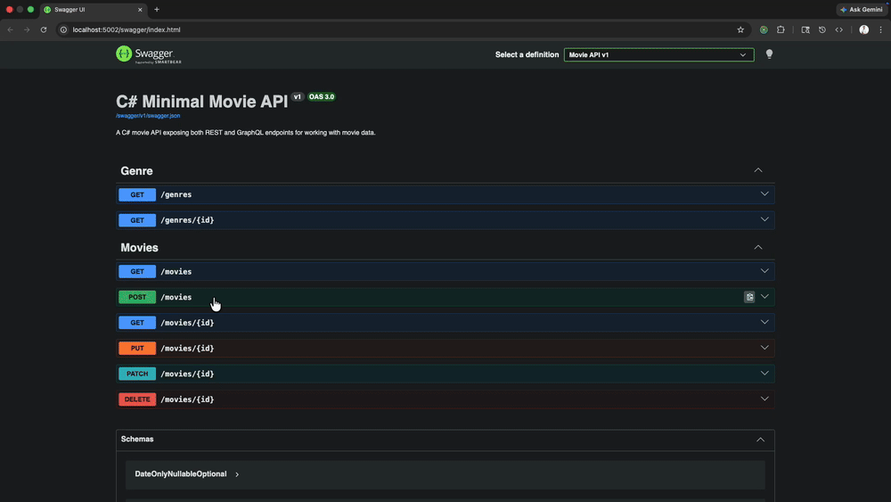
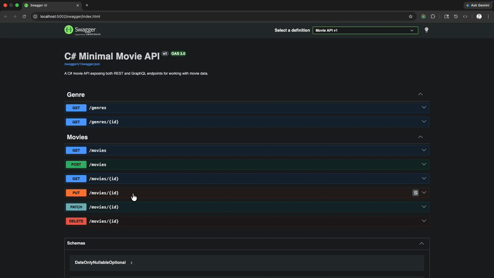
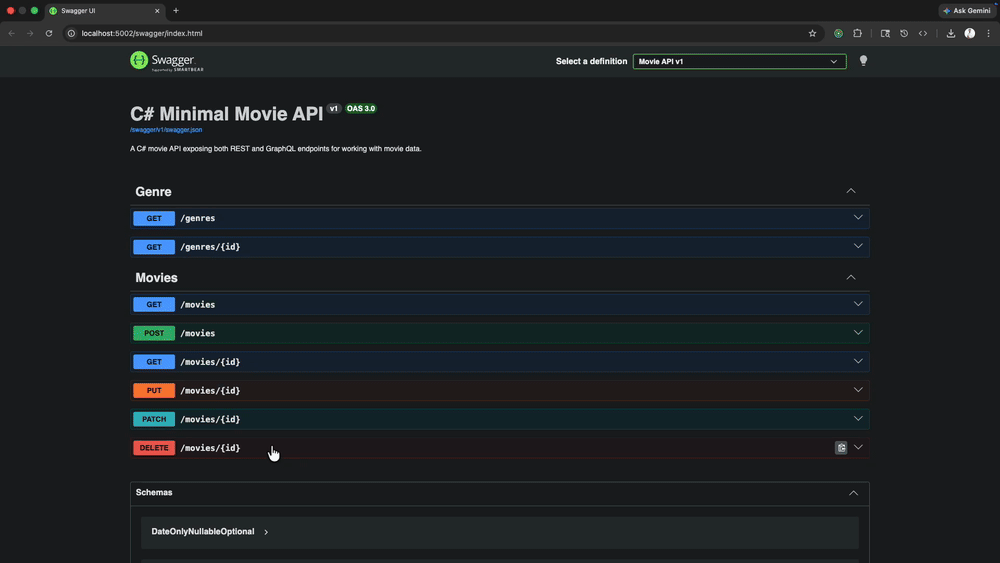
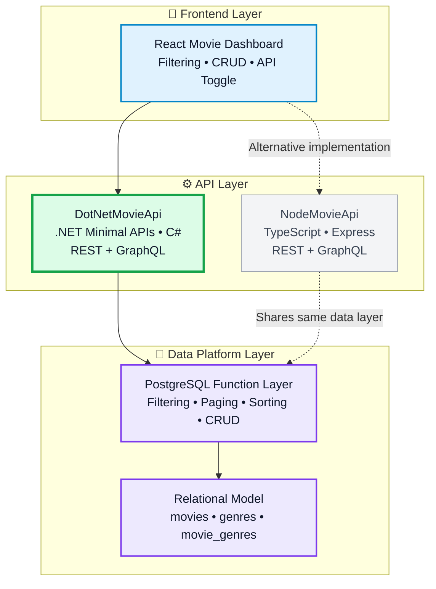

# 🎬 DotNetMovieApi

A production-style .NET backend demonstrating **REST + GraphQL parity**, PostgreSQL-driven query logic, and clean architecture using Minimal APIs and Dapper.

---

## 🎬 Demo

### 🔍 Fetch Movies


### ✨ Create Movie



### ✏️ Update Movie



### 🩹 Patch Movie


### 🗑️ Delete Movie



---

## ⭐ Key Concept

This project demonstrates how **REST and GraphQL can share the same repository layer and PostgreSQL functions**, eliminating duplicated business logic while supporting multiple API paradigms.

---

## 🏗️ Platform Architecture



This repository is the **.NET / C# implementation** of a multi-stack movie platform that shares a common PostgreSQL function layer with the Node.js API.

## ⚙️ Tech Stack

* .NET 10
* C#
* ASP.NET Core Minimal APIs
* Dapper
* PostgreSQL (`Npgsql`)
* Hot Chocolate GraphQL
* Swagger / Swashbuckle

---

## 🚀 Capabilities

* REST and GraphQL endpoints over a shared repository layer
* Advanced filtering, sorting, and pagination powered by PostgreSQL functions
* Partial updates via GraphQL using JSONB patching
* Centralized logging, correlation IDs, and error handling
* Swagger UI for API exploration

---

## 🧠 Why This Project

This API demonstrates real-world backend architecture patterns including separation of concerns, reusable data access layers, and multi-interface API design (REST + GraphQL) over a shared domain model.

---

## 📡 API Overview

### REST

* `GET /movies`
* `GET /movies/{id}`
* `POST /movies`
* `PUT /movies/{id}`
* `PATCH /movies/{id}`
* `DELETE /movies/{id}`
* `GET /genres`
* `GET /genres/{id}`
* `GET /health`

👉 Swagger UI:
`http://localhost:5000/swagger`

---

### GraphQL

* `GET /graphql`
* `POST /graphql`

#### Example Query

```graphql
query {
  movies(filters: { search: "avatar", searchMode: "general", page: 1, pageSize: 10 }) {
    items {
      id
      movieName
      releaseDate
      genres
    }
    totalCount
    totalPages
  }
}
```

---

## 🛠️ Running Locally

### Requirements

* .NET 10 SDK
* PostgreSQL

### Setup

```bash
dotnet restore
dotnet build
dotnet run
```

---

## 🔗 Related Projects

* **NodeMovieApi (TypeScript implementation)**
* **Postgres-Movie-Platform (database + functions)**

---

## 💡 Project Highlights

* Demonstrates **REST + GraphQL coexistence without duplication**
* Uses **PostgreSQL functions for complex querying**
* Implements **production-style backend patterns**
* Part of a **multi-stack backend platform**

---

## 👨‍💻 Author

**Steven Wickers**
Senior / Lead Frontend Engineer
React • TypeScript • Node • C# • PostgreSQL • Cloud
